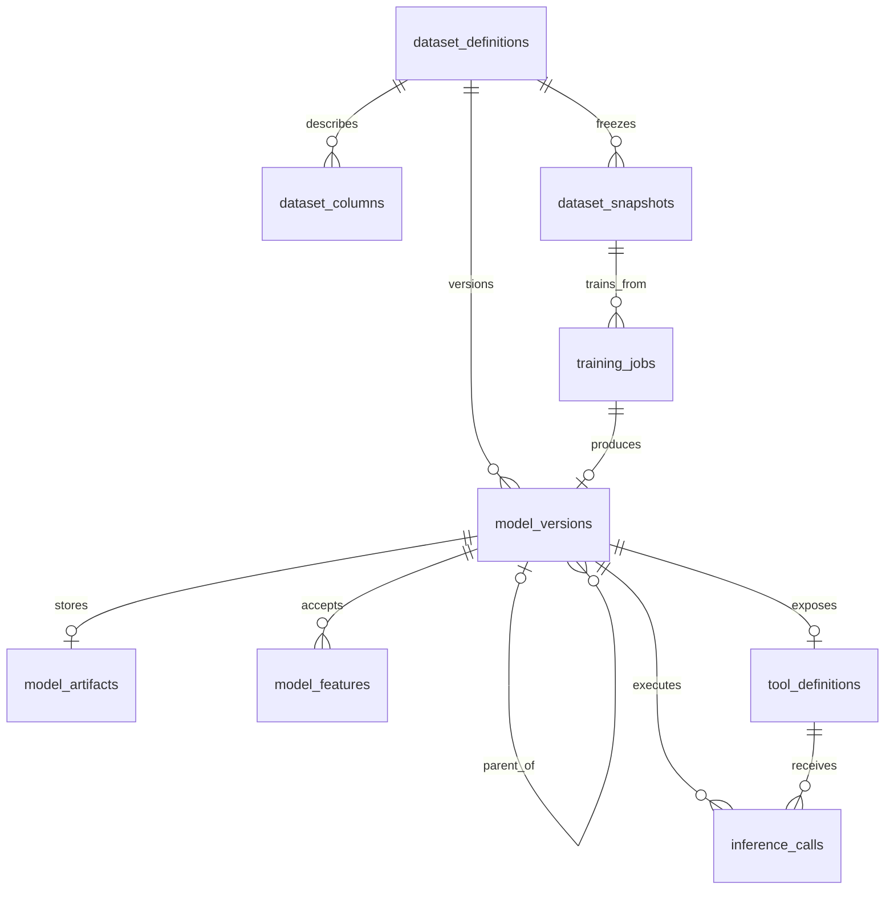

# PostgreSQL Schema

## Local tenant bootstrap

Nucleus owns tenant provisioning. For local development, start PostgreSQL and the
Nucleus API, then run:

```powershell
bun run --cwd apps/api tenant:bootstrap
```

The command calls Nucleus tenant self-signup when `ampersand-dev` does not exist.
Nucleus creates the `main.tenants` record, `tenant_ampersand_dev` schema, tenant
admin, system tables, and project tables. The command then applies
`apps/api/migrations/0001_ampersand_constraints.sql` with the tenant schema first
on `search_path`. Re-running it is safe because both provisioning lookup and the
migration constraints are idempotent.

The local tenant values are configured by `NUCLEUS_URL`,
`DEV_TENANT_SUBDOMAIN`, `DEV_TENANT_ADMIN_EMAIL`, and
`DEV_TENANT_ADMIN_PASSWORD`.

## Purpose and scope

PostgreSQL is Ampersand's source of truth for dataset metadata, training-job state, model versions, generated tool contracts, and inference records. It also provides the training queue. The large immutable files referenced by these records are stored outside PostgreSQL: frozen datasets use Parquet and trained models use ONNX.

This document covers the nine Ampersand-owned tables generated from `apps/api/src/entities`. Nucleus-owned tenant, user, authorization, and audit tables are outside this schema's ownership.

## Tenant ownership

Nucleus uses a schema-per-tenant design. It resolves the authenticated request to a tenant schema before Ampersand data is accessed. Each tenant receives a separate copy of the Ampersand tables, so these tables do not contain a `tenant_id` column.

```text
PostgreSQL database
├── main                    Nucleus tenant registry and platform data
├── tenant_a               Nucleus and Ampersand tenant tables
└── tenant_b               Separate Nucleus and Ampersand tenant tables
```

Nucleus owns tenant provisioning, user membership, authentication, authorization, quotas, and audit logging. Ampersand owns the domain records described below.

## Entity relationship diagram



## Common columns

Nucleus adds these columns to every Ampersand table.

| Column | PostgreSQL type | Nullable | Meaning |
|---|---|---:|---|
| `id` | `uuid` | No | Primary key; defaults to `gen_random_uuid()` |
| `created_at` | `timestamptz` | No | Creation time; defaults to `now()` |
| `updated_at` | `timestamptz` | No | Last update time; defaults to `now()` |
| `is_active` | `boolean` | No | Nucleus soft-activity flag; defaults to `true` |
| `created_by` | `uuid` | Yes | Nucleus user that created the record |
| `updated_by` | `uuid` | Yes | Nucleus user that last updated the record |

## Data dictionary

The following tables include the common columns above in addition to their domain columns.

### `dataset_definitions`

Identifies a registered PostgreSQL source table and the prediction target selected from it.

| Column | PostgreSQL type | Nullable | Meaning |
|---|---|---:|---|
| `name` | `varchar(200)` | No | Human-readable dataset name |
| `source_schema` | `varchar(63)` | No | Schema containing the registered source table |
| `source_table` | `varchar(63)` | No | Registered source table name |
| `target_column` | `varchar(63)` | No | Column the model predicts |
| `time_column` | `varchar(63)` | Yes | Column used for chronological splitting when applicable |

### `dataset_columns`

Describes the selected columns and their roles in a dataset definition.

| Column | PostgreSQL type | Nullable | Meaning |
|---|---|---:|---|
| `dataset_definition_id` | `uuid` | No | Parent dataset definition |
| `column_name` | `varchar(255)` | No | Exact source-column name |
| `role` | `varchar(16)` | No | `feature`, `target`, `time`, or `ignored` |
| `data_type` | `varchar(16)` | No | `number`, `integer`, `boolean`, `category`, `text`, or `datetime` |
| `description` | `text` | No | Human-readable column meaning |
| `unit` | `varchar(100)` | Yes | Measurement unit, when applicable |
| `is_nullable` | `boolean` | No | Whether the source column permits missing values |
| `position` | `integer` | No | Stable zero-based column order |

### `dataset_snapshots`

Registers an immutable Parquet snapshot of the data selected for training.

| Column | PostgreSQL type | Nullable | Meaning |
|---|---|---:|---|
| `dataset_definition_id` | `uuid` | No | Definition from which the snapshot was created |
| `storage_uri` | `text` | No | External Parquet file location |
| `storage_format` | `varchar(16)` | No | Artifact format; currently `parquet` |
| `content_sha256` | `char(64)` | No | SHA-256 digest of the Parquet content |
| `row_count` | `bigint` | No | Number of frozen rows |
| `schema_summary` | `jsonb` | No | Snapshot schema and summary metadata |
| `frozen_at` | `timestamptz` | No | Time at which the snapshot was frozen |

### `training_jobs`

Stores the durable training request and acts as the PostgreSQL-backed work queue.

| Column | PostgreSQL type | Nullable | Meaning |
|---|---|---:|---|
| `dataset_snapshot_id` | `uuid` | No | Immutable dataset snapshot used for training |
| `fingerprint` | `char(64)` | No | Deterministic training-request fingerprint |
| `status` | `varchar(16)` | No | `queued`, `running`, `succeeded`, `failed`, `cancelled`, or `dead` |
| `training_config` | `jsonb` | No | Training parameters included in the fingerprint |
| `progress_percent` | `integer` | No | Completion value from 0 through 100 |
| `progress_message` | `text` | Yes | Current worker activity |
| `claimed_by` | `varchar(255)` | Yes | Identifier of the worker that claimed the job |
| `queued_at` | `timestamptz` | No | Time the job entered the queue |
| `started_at` | `timestamptz` | Yes | Time processing began |
| `heartbeat_at` | `timestamptz` | Yes | Most recent worker liveness update |
| `finished_at` | `timestamptz` | Yes | Time the job entered a terminal state |
| `error_code` | `varchar(100)` | Yes | Machine-readable failure code |
| `error_message` | `text` | Yes | Human-readable failure detail |
| `max_runtime_seconds` | `integer` | No | Maximum permitted runtime |

### `model_versions`

Records the immutable identity, lifecycle, and evaluation results of a trained model version.

| Column | PostgreSQL type | Nullable | Meaning |
|---|---|---:|---|
| `dataset_definition_id` | `uuid` | No | Dataset family to which the version belongs |
| `training_job_id` | `uuid` | No | Training job that produced this version |
| `version_number` | `integer` | No | Positive sequence number within the dataset definition |
| `status` | `varchar(16)` | No | `candidate`, `published`, or `retired` |
| `parent_version_id` | `uuid` | Yes | Previous model version, when one exists |
| `metrics` | `jsonb` | No | Evaluation metrics for this model |
| `baseline_metrics` | `jsonb` | No | Metrics for the comparison baseline |
| `published_at` | `timestamptz` | Yes | Publication time |
| `published_by` | `uuid` | Yes | Nucleus user that published the model |

### `model_artifacts`

Registers the externally stored ONNX file for a model version and the information required to verify it.

| Column | PostgreSQL type | Nullable | Meaning |
|---|---|---:|---|
| `model_version_id` | `uuid` | No | Model version represented by the artifact |
| `storage_uri` | `text` | No | External ONNX file location |
| `format` | `varchar(16)` | No | Artifact format; currently `onnx` |
| `content_sha256` | `char(64)` | No | SHA-256 digest of the ONNX content |
| `size_bytes` | `bigint` | No | Expected file size in bytes |
| `producer_worker_id` | `varchar(255)` | No | Trusted worker that produced the file |
| `produced_at` | `timestamptz` | No | Artifact production time |

Snapshot Parquet files live directly under the storage root at the URI recorded in `storage_uri`. Trained model artifacts are written by Nucleus to an immutable, versioned path relative to the same root:

```
models/{datasetDefinitionId}/v{versionNumber}/{trainingJobId}.onnx
```

The private worker trains the model and submits only the contract-validated result metadata; it never writes under `models/` and never runs registration SQL. When Nucleus accepts a result over its internal endpoint, it assigns the version number inside the registration transaction: it locks the dataset definition row, takes the current maximum version plus one, promotes the worker's verified ONNX payload from its temporary name to the path above with a no-clobber hard link, re-verifies the promoted file against the payload checksum and size, and inserts the `model_versions`, `model_artifacts`, and `model_features` rows together with the `running -> succeeded` job transition in one atomic transaction. The training job id in the filename keeps a crash between promotion and commit from blocking the next version assignment. The worker must verify a snapshot checksum before training. The inference service must verify the model artifact, trusted producer, and linked published model version before loading it through this path.

### `model_features`

Freezes the ordered, bounded input contract for a particular model version.

| Column | PostgreSQL type | Nullable | Meaning |
|---|---|---:|---|
| `model_version_id` | `uuid` | No | Model version that accepts the feature |
| `column_name` | `varchar(255)` | No | Tool input and source feature name |
| `position` | `integer` | No | Zero-based ONNX input order |
| `data_type` | `varchar(16)` | No | `number`, `integer`, `boolean`, or `category` |
| `description` | `text` | No | Meaning presented in the tool contract |
| `unit` | `varchar(100)` | Yes | Measurement unit, when applicable |
| `is_required` | `boolean` | No | Whether inference requires the feature |
| `valid_min` | `numeric` | Yes | Lowest accepted numeric value |
| `valid_max` | `numeric` | Yes | Highest accepted numeric value |
| `allowed_values` | `jsonb` | Yes | Accepted categorical values |
| `missing_rate` | `numeric` | No | Proportion of missing training values, from 0 through 1 |

### `tool_definitions`

Stores the generated LLM tool contract for one model version.

| Column | PostgreSQL type | Nullable | Meaning |
|---|---|---:|---|
| `model_version_id` | `uuid` | No | Model version exposed by the tool |
| `tool_name` | `varchar(255)` | No | Name supplied to the LLM |
| `description` | `text` | No | Tool purpose supplied to the LLM |
| `input_schema` | `jsonb` | No | Generated JSON Schema for model inputs |
| `output_schema` | `jsonb` | No | Generated JSON Schema for predictions and rejections |
| `generator_version` | `varchar(50)` | No | Version of the schema-generation rules |
| `schema_sha256` | `char(64)` | No | SHA-256 digest of the generated schema |
| `generated_at` | `timestamptz` | No | Tool-generation time |

### `inference_calls`

Records each prediction attempt, including validated rejections and runtime errors.

| Column | PostgreSQL type | Nullable | Meaning |
|---|---|---:|---|
| `tool_definition_id` | `uuid` | No | Tool contract used for the call |
| `model_version_id` | `uuid` | No | Exact model version used for the call |
| `conversation_id` | `varchar(255)` | Yes | Related LLM conversation identifier |
| `input_payload` | `jsonb` | No | Inputs supplied to the tool |
| `outcome` | `varchar(16)` | No | `prediction`, `rejected`, or `error` |
| `prediction` | `numeric` | Yes | Numeric result for a successful prediction |
| `uncertainty` | `numeric` | Yes | Optional uncertainty estimate |
| `warnings` | `jsonb` | No | Boundary or quality warnings |
| `rejection_code` | `varchar(100)` | Yes | Machine-readable rejection reason |
| `rejection_message` | `text` | Yes | Human-readable rejection explanation |
| `latency_ms` | `integer` | No | Non-negative processing duration in milliseconds |

## Relationships and delete behavior

| Child column | Parent column | Delete behavior |
|---|---|---|
| `dataset_columns.dataset_definition_id` | `dataset_definitions.id` | `CASCADE` |
| `dataset_snapshots.dataset_definition_id` | `dataset_definitions.id` | `CASCADE` |
| `training_jobs.dataset_snapshot_id` | `dataset_snapshots.id` | `RESTRICT` |
| `model_versions.dataset_definition_id` | `dataset_definitions.id` | `RESTRICT` |
| `model_versions.training_job_id` | `training_jobs.id` | `RESTRICT` |
| `model_versions.parent_version_id` | `model_versions.id` | Intended `SET NULL`; requires the manual migration described below |
| `model_versions.published_by` | Nucleus `users.id` | Intended `SET NULL`; requires the manual migration described below |
| `model_artifacts.model_version_id` | `model_versions.id` | `RESTRICT` |
| `model_features.model_version_id` | `model_versions.id` | `CASCADE` |
| `tool_definitions.model_version_id` | `model_versions.id` | `RESTRICT` |
| `inference_calls.tool_definition_id` | `tool_definitions.id` | `RESTRICT` |
| `inference_calls.model_version_id` | `model_versions.id` | `RESTRICT` |

Cascade is limited to dependent descriptive records. Training history, model artifacts, tools, and inference history use restricted deletion to preserve provenance and auditability.

## PostgreSQL-backed queue and heartbeat

Creating a training request inserts a `training_jobs` row with `status = 'queued'`. A private worker claims one available row in a transaction using `FOR UPDATE SKIP LOCKED`, then sets `status = 'running'`, `claimed_by`, `started_at`, and `heartbeat_at`. This prevents concurrent workers from claiming the same job without requiring Redis.

While training, the worker updates `heartbeat_at` and progress fields. Nucleus treats a running job with an expired heartbeat or runtime as dead and transitions it to `dead`. Terminal states set `finished_at`; failures also populate `error_code` and `error_message`.

## External artifact storage

PostgreSQL stores references and verification metadata, not the large binary data itself.

| Content | External format | Database record | Verification |
|---|---|---|---|
| Frozen training rows | Parquet | `dataset_snapshots` | `content_sha256`, row count, and schema summary |
| Trained model | ONNX | `model_artifacts` | `content_sha256`, file size, and producer worker identity |

The worker must verify a snapshot checksum before training. The inference service must verify the model artifact, trusted producer, and linked published model version before loading it.

## Important invariants

- A training fingerprint identifies one exact snapshot and training configuration; duplicate fingerprints are rejected.
- Job states are limited to `queued`, `running`, `succeeded`, `failed`, `cancelled`, and `dead`.
- A running job must maintain a recent heartbeat.
- Model states are limited to `candidate`, `published`, and `retired`; only a published model is callable.
- Each prediction or rejection records both the tool definition and exact model version.
- A rejected or errored inference never stores a numeric prediction. A rejection includes a code and message.
- Feature values outside the model's frozen bounds are rejected before inference.
- Dataset snapshots and model artifacts are checked against their SHA-256 digests.
- Tenant isolation is provided by Nucleus routing each operation to a separate PostgreSQL schema.

## Indexes and uniqueness

The intended schema defines these unique keys:

| Table | Column or columns | Purpose |
|---|---|---|
| `dataset_columns` | (`dataset_definition_id`, `column_name`) | One description per source column in a definition |
| `dataset_snapshots` | `content_sha256` | One record per frozen content digest |
| `training_jobs` | `fingerprint` | Prevent duplicate training requests |
| `model_versions` | `training_job_id` | One model version per successful training job |
| `model_versions` | (`dataset_definition_id`, `version_number`) | Unique sequential version within a dataset family |
| `model_artifacts` | `model_version_id` | One ONNX artifact per model version |
| `model_artifacts` | `content_sha256` | One record per model content digest |
| `model_features` | (`model_version_id`, `column_name`) | One input contract per named feature |
| `model_features` | (`model_version_id`, `position`) | Unambiguous model input order |
| `tool_definitions` | `model_version_id` | One generated tool per model version |
| `tool_definitions` | `tool_name` | Unique tool name within a tenant schema |
| `tool_definitions` | `schema_sha256` | One record per generated schema digest |

Primary keys are indexed automatically. The current entity definitions add no additional non-unique Ampersand indexes.

## Nucleus 0.9.805 generator limitations and manual migration

The entity JSON files express more constraints than Nucleus 0.9.805 currently emits into the generated tenant-schema Drizzle definitions. An explicit SQL migration is required before the schema can be considered fully enforced by PostgreSQL.

The manual migration must add:

1. All declared `CHECK` constraints for allowed lifecycle/type values, positive or bounded numeric fields, inference outcome consistency, and valid feature ranges.
2. The three declared composite unique constraints:
   - `model_versions (dataset_definition_id, version_number)`
   - `model_features (model_version_id, column_name)`
   - `model_features (model_version_id, position)`
3. The missing foreign keys:
   - `model_versions.parent_version_id -> model_versions.id ON DELETE SET NULL`
   - `model_versions.published_by -> users.id ON DELETE SET NULL`
4. The three inline unique constraints lost when tenant-schema foreign-key columns are regenerated:
   - `model_versions.training_job_id`
   - `model_artifacts.model_version_id`
   - `tool_definitions.model_version_id`

These are generator limitations, not optional application rules. Until the migration is applied, application validation alone does not provide equivalent concurrency-safe enforcement.

The idempotent migration is stored at `apps/api/migrations/0001_ampersand_constraints.sql`. It adds all 21 declared checks, the three composite unique keys, the three tenant-schema one-to-one unique keys, and the two missing foreign keys.

Nucleus must apply the migration once after creating the generated tables in each tenant schema. Set that tenant schema first on `search_path`, then execute the file in the same session. For example, in `psql`:

```sql
SET search_path TO tenant_schema, public;
\i apps/api/migrations/0001_ampersand_constraints.sql
```

The migration resolves unqualified table names against the active tenant schema and can safely be run again. PostgreSQL validates existing rows while adding the checks, foreign keys, and unique constraints, so invalid or duplicate existing data must be corrected before the migration can complete.
