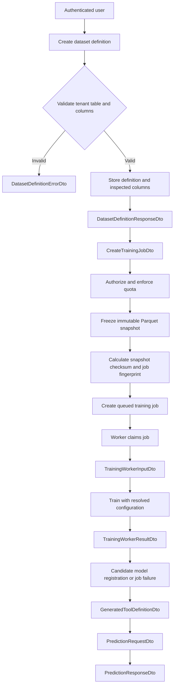

# Shared Data and Training Contracts

## Purpose and ownership

This document defines the shared boundary between Ampersand's frontend, Nucleus service, and private training worker. The TypeBox schemas in `packages/contracts/src` are the source of truth.

- Member B owns request validation, authorization, snapshot orchestration, queue creation, job lifecycle, and API responses through Nucleus.
- Member A owns dataset freezing and training behavior behind the agreed contracts.
- Both members must review changes to shared DTOs, snapshot metadata, training configuration, and lifecycle rules.

Nucleus remains the only public gateway. The worker does not accept requests directly from users.

## End-to-end flow



## Dataset-definition contract

### Request

`CreateDatasetDefinitionDto` registers a model-training definition based on an existing PostgreSQL table in the authenticated tenant.

| Field | Type | Rules |
|---|---|---|
| `name` | string | 1-200 characters |
| `sourceTable` | PostgreSQL identifier | 1-63 characters; letters, digits, and underscores; cannot begin with a digit |
| `features` | `DatasetColumnInputSchema[]` | At least one feature |
| `target` | `DatasetColumnInputSchema` | Required |
| `timeColumn` | `DatasetColumnInputSchema` | Optional |

Each column input contains `name`, a 1-500 character `description`, and an optional 1-100 character `unit`. Additional properties are rejected.

```json
{
  "name": "Energy usage predictor",
  "sourceTable": "energy_readings",
  "features": [
    {
      "name": "temperature",
      "description": "Outside temperature",
      "unit": "celsius"
    },
    {
      "name": "occupancy",
      "description": "Number of occupants",
      "unit": "people"
    }
  ],
  "target": {
    "name": "energy_usage",
    "description": "Building energy consumption",
    "unit": "kWh"
  },
  "timeColumn": {
    "name": "recorded_at",
    "description": "Time when the reading was recorded"
  }
}
```

The request does not accept a schema name, data types, nullability, roles, or positions. Nucleus derives the tenant schema from authentication, inspects types and nullability from PostgreSQL, infers roles from the DTO structure, and preserves feature-array order as position.

### Success response

`DatasetDefinitionResponseDto` returns the stored definition and inspected column metadata.

| Field | Type | Meaning |
|---|---|---|
| `id` | UUID | Dataset-definition identifier |
| `name` | string | Display name |
| `sourceTable` | string | Registered source table |
| `targetColumn` | string | Prediction target |
| `timeColumn` | string or null | Chronological split column |
| `columns` | `DatasetColumnDto[]` | Inspected columns and roles |
| `createdAt` | date-time string | Creation time |

`DatasetColumnDto` contains `id`, `name`, `role`, `dataType`, `description`, `unit`, `isNullable`, and zero-based `position`. Roles are `feature`, `target`, `time`, or `ignored`. Supported response types are `number`, `integer`, `boolean`, `category`, `text`, and `datetime`.

```json
{
  "id": "11c1e849-9060-4342-bda6-ef19d4abf745",
  "name": "Energy usage predictor",
  "sourceTable": "energy_readings",
  "targetColumn": "energy_usage",
  "timeColumn": "recorded_at",
  "columns": [
    {
      "id": "563e5dc9-fd17-421d-a9f7-d7d8ef7feaa1",
      "name": "temperature",
      "role": "feature",
      "dataType": "number",
      "description": "Outside temperature",
      "unit": "celsius",
      "isNullable": false,
      "position": 0
    }
  ],
  "createdAt": "2026-08-03T12:00:00.000Z"
}
```

### Validation error

`DatasetDefinitionErrorDto` provides a stable machine-readable code, summary message, and field-level issues.

```json
{
  "error": {
    "code": "COLUMN_NOT_FOUND",
    "message": "One or more selected columns do not exist.",
    "issues": [
      {
        "path": "features[1].name",
        "message": "Column 'occupancy' does not exist in energy_readings."
      }
    ]
  }
}
```

Allowed error codes are:

- `SOURCE_TABLE_NOT_FOUND`
- `SOURCE_TABLE_NOT_ALLOWED`
- `COLUMN_NOT_FOUND`
- `DUPLICATE_FEATURE`
- `TARGET_IS_FEATURE`
- `TIME_COLUMN_CONFLICT`
- `UNSUPPORTED_COLUMN_TYPE`
- `INVALID_TIME_COLUMN_TYPE`

### Validation responsibilities and HTTP mapping

Nucleus must verify that the source table is allowed and exists in the authenticated tenant, selected columns exist, features are unique, roles do not conflict, column types are supported, and an optional time column has a valid type. It must not accept arbitrary SQL or a client-selected tenant schema.

| HTTP status | Use |
|---:|---|
| `400` | Malformed request DTO |
| `403` | Source table is not allowed |
| `404` | Source table does not exist |
| `422` | Selected columns, roles, or types are invalid |

Authentication and general authorization responses remain Nucleus-owned.

## Snapshot-before-queue boundary

Snapshot creation completes before a training job is queued:

1. Nucleus authenticates and authorizes the request and enforces quota.
2. The snapshot service reads the registered tenant table and selected columns.
3. It writes an immutable Parquet file and calculates its SHA-256 digest, row count, and schema metadata.
4. Ampersand creates the `dataset_snapshots` record.
5. Ampersand calculates the deterministic training fingerprint and creates a `queued` job.

The user never supplies the snapshot ID, storage URI, checksum, row count, or schema summary. If snapshot creation fails, no training job is created.

## Training contract

### Training request

`CreateTrainingJobDto` accepts only the selected dataset definition:

```json
{
  "datasetDefinitionId": "11c1e849-9060-4342-bda6-ef19d4abf745"
}
```

No additional properties are accepted. Training policy is resolved by the server rather than supplied by the user.

### Resolved training configuration

`ResolvedTrainingConfigDto` contains:

| Field | Type | Rule |
|---|---|---|
| `trainerVersion` | string | Required |
| `algorithmPolicy` | literal | `automatic-regression` |
| `randomSeed` | integer | Required |
| `splitStrategy` | literal | `chronological` |
| `testFraction` | number | Greater than 0 and less than 1 |
| `maxRuntimeSeconds` | integer | At least 1 |

```json
{
  "trainerVersion": "1.0.0",
  "algorithmPolicy": "automatic-regression",
  "randomSeed": 42,
  "splitStrategy": "chronological",
  "testFraction": 0.2,
  "maxRuntimeSeconds": 600
}
```

The server-controlled configuration preserves reproducibility, prevents future leakage through a non-chronological split, and prevents clients from bypassing runtime policy.

### Training-job response

`TrainingJobResponseDto` is used after job creation and for status reads. It contains the job `id`, `datasetSnapshotId`, 64-character lowercase hexadecimal `fingerprint`, `status`, resolved `trainingConfig`, progress fields, lifecycle timestamps, and nullable structured `error`.

```json
{
  "id": "a7b59df3-4265-457e-abdb-f213f0144058",
  "datasetSnapshotId": "21ffd036-2305-49d1-9671-deed333cb1d3",
  "fingerprint": "2e43c39a4c90a18f8c32cdff57e431c849c4f7456a14bba89690f486f6fd91da",
  "status": "queued",
  "trainingConfig": {
    "trainerVersion": "1.0.0",
    "algorithmPolicy": "automatic-regression",
    "randomSeed": 42,
    "splitStrategy": "chronological",
    "testFraction": 0.2,
    "maxRuntimeSeconds": 600
  },
  "progressPercent": 0,
  "progressMessage": "Waiting for a worker",
  "queuedAt": "2026-08-03T12:00:00.000Z",
  "startedAt": null,
  "heartbeatAt": null,
  "finishedAt": null,
  "error": null
}
```

Status values are `queued`, `running`, `succeeded`, `failed`, `cancelled`, and `dead`. `progressPercent` is constrained from 0 through 100. A non-null error contains string `code` and `message` fields.

### Worker input

`TrainingWorkerInputDto` is the immutable boundary supplied to the private worker after it claims a job.

| Field | Meaning |
|---|---|
| `tenantSchema` | Tenant schema containing the job records |
| `jobId` | Claimed job UUID |
| `jobFingerprint` | Exact training-request fingerprint |
| `datasetDefinitionId` | Source definition UUID |
| `snapshot` | Parquet ID, URI, checksum, and positive row count |
| `features` | Ordered feature names and supported worker data types |
| `target` | Numeric target name and type |
| `timeColumn` | Time-column identifier or null |
| `trainingConfig` | Server-resolved training policy |
| `artifactOutputDirectory` | Approved output location |
| `heartbeatIntervalSeconds` | Positive heartbeat interval |

Worker feature types are limited to `number`, `integer`, `boolean`, and `category`; target types are limited to `number` and `integer`. The snapshot format is fixed to `parquet` and its digest must be 64 lowercase hexadecimal characters.

The worker reads rows from the referenced Parquet file; dataset rows are not embedded in the DTO. Before training, it must verify the snapshot checksum. The worker cannot choose another tenant, snapshot, feature set, target, configuration, or artifact directory.

## Job lifecycle

```text
queued -> running -> succeeded
   |         |----> failed
   |         |----> cancelled
   |         `----> dead
   `--------------> cancelled
```

| Transition | Owner |
|---|---|
| `queued -> running` | Worker |
| `queued -> cancelled` | Nucleus |
| `running -> succeeded` | Worker |
| `running -> failed` | Worker |
| `running -> cancelled` | Nucleus |
| `running -> dead` | Nucleus |

The worker heartbeat interval is 10 seconds. Nucleus may mark a running job dead after 30 seconds without a heartbeat. `succeeded`, `failed`, `cancelled`, and `dead` are terminal states and have no outgoing transitions.

Lifecycle writes must be conditional on the current state. Worker progress, heartbeat, success, and failure updates must also match the claiming worker so a cancelled or dead job cannot later be overwritten by a stale worker.

## DTO inventory

| DTO or constant | Purpose |
|---|---|
| `PostgreSqlIdentifierSchema` | Safe PostgreSQL table and column identifiers |
| `DatasetColumnInputSchema` | User-supplied column description |
| `CreateDatasetDefinitionDto` | Dataset-definition request |
| `DatasetColumnRoleDto` | Dataset column roles |
| `DatasetColumnTypeDto` | Inspected dataset data types |
| `DatasetColumnDto` | Stored and inspected column response |
| `DatasetDefinitionResponseDto` | Dataset-definition success response |
| `DatasetDefinitionErrorCodeDto` | Dataset validation error codes |
| `ValidationIssueDto` | Field-level validation issue |
| `DatasetDefinitionErrorDto` | Dataset-definition error response |
| `CreateTrainingJobDto` | Training request |
| `TrainingJobStatusDto` | Job lifecycle states |
| `ResolvedTrainingConfigDto` | Server-controlled training policy |
| `TrainingJobErrorDto` | Structured job error |
| `TrainingJobResponseDto` | Job creation and status response |
| `TrainingWorkerFeatureDataTypeDto` | Worker-supported feature types |
| `TrainingWorkerFeatureDto` | Ordered worker feature |
| `TrainingWorkerTargetDto` | Numeric worker target |
| `TrainingWorkerSnapshotDto` | Verified Parquet snapshot reference |
| `TrainingWorkerInputDto` | Complete immutable worker input |
| `TrainingWorkerMetricsDto` | Model or baseline regression metrics |
| `TrainingWorkerArtifactDto` | Produced ONNX artifact metadata |
| `TrainingWorkerModelFeatureDto` | Frozen feature bounds and categories |
| `TrainingWorkerSuccessDto` | Successful training result |
| `TrainingWorkerFailureDto` | Structured training failure |
| `TrainingWorkerResultDto` | Complete worker-to-Nucleus result |
| `ToolPropertyTypeDto` | JSON Schema types supported by generated feature properties |
| `ToolInputPropertyDto` | Generated JSON Schema property for one model feature |
| `ToolInputSchemaDto` | Generated tool input JSON Schema |
| `ToolOutputSchemaDto` | Generated tool output JSON Schema |
| `GeneratedToolDefinitionDto` | Nucleus-generated definition for a published model tool |
| `PredictionInputValueDto` | Scalar value accepted in prediction inputs |
| `PredictionRequestDto` | Prediction tool invocation request |
| `PredictionRejectionCodeDto` | Stable input-rejection reason codes |
| `PredictionRejectionFieldDto` | Field-level rejection detail |
| `PredictionRejectionDto` | Structured reasoned rejection |
| `PredictionSuccessResponseDto` | Successful numerical prediction response |
| `PredictionRejectedResponseDto` | Rejected-input response without a prediction |
| `PredictionResponseDto` | Discriminated prediction or rejection response |
| `TRAINING_JOB_TRANSITIONS` | Allowed state transitions |
| `TERMINAL_TRAINING_JOB_STATUSES` | Immutable terminal states |
| `TRAINING_JOB_TRANSITION_OWNERS` | Nucleus or worker transition ownership |
| `TRAINING_JOB_HEARTBEAT_INTERVAL_SECONDS` | Heartbeat interval; 10 seconds |
| `TRAINING_JOB_DEAD_THRESHOLD_SECONDS` | Dead-job threshold; 30 seconds |

## Security and reproducibility decisions

- Tenant schema selection comes from Nucleus authentication, never from a public request DTO.
- Users select registered tables and columns; arbitrary SQL is not accepted.
- PostgreSQL inspection is authoritative for column types and nullability.
- Snapshots are immutable Parquet files verified with SHA-256 before training.
- A deterministic fingerprint prevents duplicate training for the same snapshot and configuration.
- Training configuration is resolved by the server and includes a fixed trainer version, random seed, chronological split, test fraction, and runtime bound.
- Only the private worker receives `TrainingWorkerInputDto`; no public route exposes worker control.
- Conditional lifecycle updates prevent stale workers from overwriting cancellation or dead-job decisions.
- Users and workers cannot provide tool schemas; Nucleus generates them from a published model and its frozen features.
- Nucleus resolves the published model version for a tool call instead of accepting a caller-selected version.
- Invalid or out-of-range inference input produces a reasoned rejection and never a numerical prediction.

## Worker result

`TrainingWorkerResultDto` is the worker-to-Nucleus boundary after a training attempt. Every result identifies the job, exact training fingerprint, and claiming worker.

A successful `result` uses `TrainingWorkerSuccessDto` with the literal status `succeeded`. It contains model and baseline MAE, RMSE, and R-squared metrics through `TrainingWorkerMetricsDto`; ONNX URI, lowercase SHA-256 digest, and positive file size through `TrainingWorkerArtifactDto`; and at least one ordered `TrainingWorkerModelFeatureDto`. Each model feature records its data type, nullable numeric bounds, nullable allowed values, and a missing rate from 0 through 1. Nucleus uses these fields to register the candidate model, artifact, and frozen model-feature contract.

A failed `result` uses `TrainingWorkerFailureDto` with the literal status `failed` and contains a non-empty machine-readable error code and human-readable message. The success and failure shapes are mutually exclusive and reject additional properties. Nucleus verifies the UUID, 64-character lowercase fingerprint, and worker ownership before accepting either result so stale or unrelated workers cannot complete the job.

## Generated tool definition

`GeneratedToolDefinitionDto` is created by Nucleus when a model version is published. It identifies the model version, tool name, description, and generator version, and contains the JSON Schemas used to advertise and validate the tool.

`ToolInputSchemaDto` is an object schema composed of `ToolInputPropertyDto` entries. Supported property types are `number`, `integer`, `boolean`, and `string`. Numeric properties may include minimum and maximum values, while categorical properties may include a non-empty list of allowed string or numeric values. Required property names must be unique, and every generated input schema rejects additional properties.

`ToolOutputSchemaDto` advertises the complete output object and requires `outcome`, `prediction`, `uncertainty`, `modelVersion`, `warnings`, and `rejection`. It describes both possible outcomes: a numerical prediction or a reasoned rejection.

Neither users nor the training worker provide this DTO. Nucleus generates and stores it from the published model version, model features, and dataset descriptions.

## Prediction contract

`PredictionRequestDto` contains the tool name, an optional non-empty conversation identifier, and feature inputs whose values are limited to strings, numbers, or booleans. It rejects additional request fields and does not accept a model version. Nucleus resolves the version currently published for the requested tool, checks authorization and quota, and validates the inputs against the stored tool definition before inference.

`PredictionResponseDto` is discriminated by `outcome`:

- `prediction` includes a numerical prediction, optional uncertainty, exact model version ID and number, warnings, and a null rejection.
- `rejected` includes no prediction or uncertainty. It identifies the exact resolved model version and supplies a structured rejection with field-level details.

`PredictionSuccessResponseDto` requires `outcome: "prediction"`, a numerical prediction, non-negative or null uncertainty, exact model version information, warnings, and a null rejection. `PredictionRejectedResponseDto` requires `outcome: "rejected"`, null prediction and uncertainty, exact model version information, warnings, and `PredictionRejectionDto`. `PredictionResponseDto` is the union of these two mutually consistent branches.

`PredictionRejectionCodeDto` allows `OUT_OF_RANGE`, `INVALID_TYPE`, `MISSING_FEATURE`, `UNKNOWN_FEATURE`, and `VALUE_NOT_ALLOWED`. Each rejection contains a summary and at least one `PredictionRejectionFieldDto` naming the affected input and explaining the problem. Nucleus records both successful and rejected calls in `inference_calls`.

## Runtime contract validation

Runtime validation tests are in `packages/contracts/src/contracts.test.ts`. They use TypeBox's runtime `Value.Check` validator and cover valid and invalid payloads across the dataset, training-job, worker-input, worker-result, generated-tool, and prediction contracts.

The tests specifically verify UUID and date-time formats, PostgreSQL identifiers, lowercase SHA-256 digests, numeric limits, unique required fields, rejection of additional properties, and consistency of the worker success/failure and prediction/rejection branches. Run them from the repository root with:

```text
bun --cwd packages/contracts test
```

Run static TypeScript validation separately with:

```text
bun --cwd packages/contracts typecheck
```
